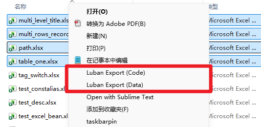

<div align="center">

# EsyLuban

**策划友好的游戏配置表导出工具**

[](LICENSE)
[](#平台)
[](https://github.com/focus-creative-games/luban)

[快速开始](#快速开始) · [文档](esyluban/docs/README.md) · [与 Luban 的区别](#与-luban-的区别)

[English](README_EN.md)

</div>

---

[Luban](https://github.com/focus-creative-games/luban) 的一个 fork，为配置表加上**自包含定义**与 **Windows 右键导表**。

每张表在自己的第一行声明自己，改哪张表就右键哪张表 —— 不必维护集中式的
`__tables__.xlsx`，也不必让策划开命令行。



装一次即可，之后随项目升级。多个项目可以各装一套，互不干扰。

数据输出与上游逐字节相同，由回归基线保证。对上游代码只新增、不修改，完整改动面
登记在 [`upstream_boundary.txt`](esyluban/upstream_boundary.txt) 并由回归逐条比对。

MIT 许可；上游 Luban 版权归 Code Philosophy Technology Ltd. 所有。

## 快速开始

从 [Releases](../../releases) 下载解压，然后：

```bat
Tools\Luban\gen.bat -t client -d json
```

`Generated\Data\` 下出现 json，说明工具链在你的机器上是好的。接下来读
[接入你的项目](esyluban/docs/setup.md)。

两个包功能相同：`standalone` 解压即用；小包约 2 MB，需要
[.NET 8](https://dotnet.microsoft.com/download/dotnet/8.0)。

## 一张表长什么样

|  | A | B | C | D |
|---|---|---|---|---|
| **1** | `##export` | `full_name="item.TbItem" & read_schema_from_file="true"` | | |
| **2** | `##var` | `id` | `name` | `price` |
| **3** | `##type` | `int` | `string` | `int` |
| **4** | | 1001 | Sword | 200 |

B1 里只有 `full_name` 是必填的。

## 与 Luban 的区别

| | Luban | EsyLuban |
|---|---|---|
| 表怎么被发现 | 在 `__tables__.xlsx` 里登记 | 表自己的 A1/B1 声明自己 |
| 嵌套结构定义在哪 | schema XML | 可以写在同一个文件的 `__beans__` sheet |
| 策划怎么导表 | 命令行 | 右键菜单 |

两种表定义方式**可以共存**，已有的 `__tables__.xlsx` 继续有效。

## 平台

工具链仅支持 Windows —— 右键菜单是这个 fork 的核心，它住在注册表里。
解析表格的核心库是普通 .NET，跨平台可用，CI 里有一个 Linux job 证明这一点。

## 文档

| | |
|---|---|
| [写一张表](esyluban/docs/writing-tables.md) | 给策划 |
| [接入你的项目](esyluban/docs/setup.md) | 给程序员 |
| [表格式参考](esyluban/docs/table-format.md) | 类型、嵌套、纵表、校验器 |
| [配置参考](esyluban/docs/configuration.md) | `luban.conf` 与命令行 |
| [目标与输出](esyluban/docs/targets-and-output.md) | 三种 target、格式选型、输出目录 |
| [右键菜单](esyluban/docs/context-menu.md) | 安装、多套件、升级 |
| [出错了怎么办](esyluban/docs/troubleshooting.md) | 报错查询 |
| [它是怎么工作的](esyluban/docs/how-it-works.md) | 导表链路与扩展点 |

完整索引见 [esyluban/docs/](esyluban/docs/README.md)。
