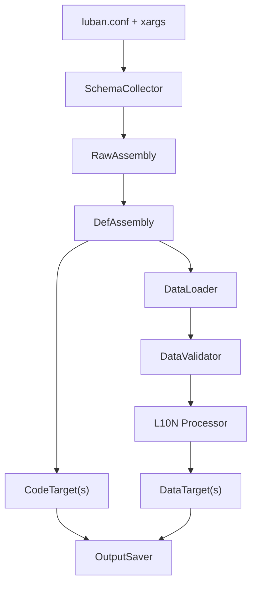

# EsyLuban 完全手册（面向策划与程序）

这是一份**生产流程手册**，给真正使用的人看的：  
第一读者是策划，第二读者是程序员。  
策划只需要理解能正确写表与右键导表；  
程序员需要理解配置链路、每个参数的影响、完整示例与最佳实践。  

说明：本手册所有内容均基于源码与脚本行为验证，并对官方文档进行二次查证重写（参考 [Luban 官方文档](https://www.datable.cn/docs/intro)）。  

---

## A. 给策划的使用说明（只学你需要的）

### A1. 你只需要记住的 5 件事

1) **右键导表**是唯一入口。  
2) 每个 Sheet 都必须有 `A1=##export` 与 `B1=表定义`。  
3) 表头必须有 `##var`（字段名）与 `##type`（字段类型）。  
4) 类型写错会导致导出失败（尤其是 bool、enum、text）。  
5) 出错看提示：会告诉你哪个表、哪一行有问题。  

---

### A2. 你的日常工作流程（生产流程）

1) 按模板写表（A3）。  
2) 保存 Excel。  
3) 在 Excel 文件或数据目录上 **右键 -> Luban Export**。  
4) 等待生成完成。  

你不需要了解命令行或脚本细节。  

---

### A3. 表的标准写法（可视化示例）

#### A3.1 每张表必须有的两行

- **A1**：`##export`  
- **B1**：表定义  

```
A1: ##export
B1: full_name="item.TbItem"
```

**`full_name` 是唯一必填项**，其余字段都有缺省，能不写就不写：

| 字段 | 不写时 | 什么时候才需要写 |
|---|---|---|
| `value_type` | 由表名推导：`TbItem` → `Item` | 值类型名不遵循 `Tb` 前缀约定时 |
| `output` | 由全名生成：`item.TbItem` → `item_tbitem` | 想自定义输出文件名时 |
| `input` | 指向本 sheet 自己 | 数据在别的文件 / 多个数据源时 |
| `index` | 取值类型的第一个字段 | 主键不是第一个字段时 |
| `mode` | `map` | 单例表填 `one`，列表表填 `list` |
| `read_schema_from_file` | `false`（结构来自 XML 或 `__beans__`） | 想让结构也写在本表标题行里，填 `true` |

需要时再逐项添加，例如：

```
B1: full_name="item.TbItem" & index="uid" & mode="list" & comment="道具表"
```

补充：  
- `A1=##export=false` 表示该 Sheet 不导出  
- 输出文件的默认命名规则：`full_name` 中 `.` → `_` 并转小写  

#### A3.2 标准表头

```
##var   id    name    price    desc
##type  int   string  int      text
```

含义：  
- `##var`：字段名  
- `##type`：字段类型  

#### A3.3 完整表模板（可直接照抄）

```
┌────────┬───────────────────────────────────────────────────────────────────────┐
│ A1     │ ##export                                                              │
│ B1     │ full_name="item.TbItem"                                               │
├────────┼────────┬──────────┬────────┬──────────┬──────────┐
│ ##var  │ id     │ name     │ price  │ quality  │ desc     │
│ ##type │ int    │ string   │ int    │ int      │ text     │
├────────┼────────┼──────────┼────────┼──────────┼──────────┤
│ 1      │ 1001   │ Sword    │ 200    │ 1        │ /item_1001 │
│ 2      │ 1002   │ Shield   │ 150    │ 2        │ /item_1002 │
└────────┴────────┴──────────┴────────┴──────────┴──────────┘
```

说明：  
- `desc` 用 `text` 表示本地化 key。  
- `quality` 可以直接填枚举值或数字。  

#### A3.4 `input` 的定位语法（进阶，通常由程序员配置）

不写 `input` 时它就指向本 sheet 自己，**大多数表用不到它**。

**一个 Excel 里放多张表也不需要写 `input`** —— 每个 sheet 各自写好 A1/B1，
导表时会逐个 sheet 识别，各自成为一张表。

只有一种情况需要写：**数据不在声明它的这个 sheet 里**。常见四类：

```
input="ai/behaviortrees"                    数据是整个目录下的多个文件
input="table3@test/composite_tables.json"   数据在别的文件、别的格式里
input="a.csv,b.csv,c.csv"                   逗号分隔多个数据源，合成一张表
input="test/item.xlsx"                      读该文件【全部 sheet】，合并成一张表
```

> 最后一类容易与缺省混淆：**只写文件路径（不带 `@sheet`）表示读该文件的所有
> sheet**，而缺省只读声明它的那一个 sheet。多态表常用这种写法把
> `item` / `equipment` / `decorator` 几个 sheet 合成一张表，**这种 `input` 不能省**。

第二类要注意顺序是 **sheet 名在前、文件路径在后**，与常见的 `文件#锚点` 相反：
`table3@test/composite_tables.json` 表示"该 json 里名为 table3 的那部分数据"。

理解方式：`@` 把一条路径切成「逻辑位置」和「物理落点」——
读作"逻辑上是这张表，物理上躺在那个文件里"。因此 sheet 名占据路径的一段，
写在 `@` 左边。

这是上游 Luban 的既有约定（`FileUtil.SplitFileAndSheetName`），
`luban.conf` 的 `schemaFiles`、L10N 配置也都用同一套写法。

---

### A4. 你会遇到的类型写法（含可视化例子）

#### A4.1 基础类型

- `int`：整数  
- `float`：小数  
- `bool`：只能写 `true/false/0/1`  
- `string`：字符串  
- `text`：本地化 key（如 `/item_1001`）  

#### A4.2 enum（枚举）

可以填：  
1) 枚举名字  
2) 枚举别名  
3) 数字值  

示例：
```
Common
Rare
3
```

#### A4.3 list（列表）

推荐写法（在一个单元格里填多值）：  
```
##var  ids#sep=;
##type list,int
```

数据填写：
```
1;2;3;4
```

#### A4.4 资源路径（路径校验）

如果字段是资源路径（图片、Prefab 等），通常由程序员定义为 `string#path=unity`，  
你只需要填写正确的资源相对路径。  

示例：
```
Assets/Prefabs/Item/Item_1001.prefab
```

#### A4.4.1 map（键值表，按模板填写）

map 的写法比较容易出错，**必须按程序员提供的模板填写**。  
常见模板如下（key/value 两列一组）：

```
##var   id   rewards   rewards
##var        $key      $value
##type  int  int       int

1       1001 2
```

含义：  
- `$key` 与 `$value` 成对出现  
- 如果需要多对 key/value，按模板继续扩展列或行  

#### A4.5 单例表（只配一条全局数据）

如果某张表只有一条全局数据（例如“全局配置”），  
程序员会在 B1 中把 `mode` 设为 `one`。  
你只需要填写**一行**数据即可。

示例（单例表写法）：
```
A1: ##export
B1: full_name="global.TbGlobal" & mode="one"

##var  openLevel  maxBag
##type int        int
      10          200
```

#### A4.6 text（本地化文本）

`text` 字段不是最终文案，而是“文案 key”。  
你只需要填 key，例如：
```
/item_1001_name
/ui_confirm_ok
```

这些 key 会在导出时被校验，如果不存在就会报错。  

---

### A5. 你可以放心忽略的内容

以下内容由程序员负责配置，你不需要修改：  
- 输出目录、校验参数、本地化参数（都在 `luban.conf` 里）  
- 字段类型上的校验标签，如 `string#path=unity`、`#sep=;`  

B1 里你会用到的只有 `full_name`（表的名字），偶尔加 `mode="one"`（单例表）。  
其余字段（`value_type` / `index` / `output` / `input` 等）都有默认值，
需要偏离默认时由程序员补写。

**原则：策划照模板写数据，不改字段类型与配置。**  

---

### A6. 常见错误与快速排查（策划版）

- **表不导出**：A1 不是 `##export`，或 B1 缺失。  
- **bool 报错**：写了 `Yes/No` 或其它非 `true/false/0/1`。  
- **枚举报错**：写了不存在的枚举名。  
- **text 报错**：写了不存在的 key。  
- **路径报错**：资源路径不存在或拼写错误。  

---

### A7. 导出结果在哪里（策划只需知道）

导出结果目录由程序员在 `luban.conf` 里配置。  
你只需要记住：  
- 右键导表后，配置文件会写入项目指定目录。  
- 如果失败，会告诉你具体表与行号。  

---

### A8. 策划常用表模板（拿来就用）

> B1 里**只有 `full_name` 必须写**。下面模板里出现的其它字段，都是"确实需要偏离默认"时才加的。

#### A8.1 道具表（最常见）

```
A1: ##export
B1: full_name="item.TbItem"

##var  id  name   price  iconPath               desc
##type int string int    string#path=unity      text
1001   Sword 200  Assets/Icons/Item/1001.png    /item_1001
```

注意：  
- `string#path=unity` 是程序员配置的校验标签，策划不要改  
- 值类型（`item.Item`）、主键（第一个字段 `id`）、输出文件名（`item_tbitem`）都是自动的，不用写  

#### A8.2 全局表（单例）

```
A1: ##export
B1: full_name="global.TbGlobal" & mode="one"

##var  openLevel  maxBag
##type int        int
10     200
```

> 单例表只有 `mode="one"` 需要写 —— 默认是 `map`（按主键查的普通表）。

#### A8.3 运营奖励表（列表）

```
A1: ##export
B1: full_name="mail.TbRewards"

##var  id  rewards#sep=;
##type int list,int
1      1001;1002;1003
```

> list 写法依赖 `#sep`，按模板填写，不要改结构。  
> 这里的 `list` 指字段类型；若要整张表以列表形式导出（无主键），才写 `mode="list"`。  

---

### A9. 策划填写习惯（减少错误）

- bool 只写 `true/false/0/1`  
- text 字段只写 key（不要写中文原文）  
- 路径字段必须确认资源真实存在  
- 不要随意改 B1 或表头结构  

---

### A10. 策划自检清单（右键前快速检查）

1) A1 是否为 `##export`  
2) B1 是否存在且完整  
3) 表头是否有 `##var` / `##type`  
4) bool 是否只用 `true/false/0/1`  
5) text 是否为合法 key  

## B. 给程序员的完整配置说明（含最佳实践）

这一部分按“影响链路”组织：  
- 配置如何影响导出  
- 参数应该如何写（推荐/不推荐）  
- 可执行的实战示例  

---

### B0. 接入你的游戏项目

这一节讲怎么把 EsyLuban 从零接进一个真实工程。已经接好的话直接跳 B1。

#### B0.1 拿到工具：两个发布版本

**不需要 clone，不需要构建。** Releases 里有两个包，功能完全一致：

| 包 | 体积 | 前置条件 | 每项目占用 |
|---|---|---|---|
| `EsyLuban-<版本>-win-x64-standalone.zip` | 约 34 MB | **无，解压即用** | 约 76 MB |
| `EsyLuban-<版本>-win-x64.zip` | 约 2 MB | 需要 .NET 8 运行时 | 约 6 MB |

因为约定是"每个项目自带一套 `Tools/Luban/`"，两者的取舍是**一次性安装成本 vs 每项目磁盘占用**。
团队机器统一装了 .NET 8 就用小包，否则 standalone 省事。

用小包时先确认：

```
dotnet --list-runtimes
```

输出里要有 `Microsoft.NETCore.App 8.x.x`，没有就装
[.NET 8 Runtime](https://dotnet.microsoft.com/download/dotnet/8.0)（选 **Runtime**，不需要 SDK）。

这一步由接入的程序员做一次，**策划完全不需要碰**——他们只右键。

发布包解压出来的结构**就是下面这个推荐布局本身**，可以直接照搬。

#### B0.2 维护者：从源码构建

本 fork 的维护者才需要这一节。clone 后运行（需要 .NET SDK）：

```
esyluban\scripts\build.bat                    构建 framework-dependent 到 runtime/
esyluban\scripts\build.bat --self-contained   构建 self-contained 到 runtime-sc/
```

运行时不进版本控制，clone 下来两个目录都是空的，必须先构建。打包：

```
esyluban\scripts\release\make_release.bat
esyluban\scripts\release\make_release.bat --self-contained
```

> 所有脚本调用的是 `runtime\Luban.exe`，不是 `dotnet Luban.dll`。
> 两种构建都产出 `Luban.exe`，因此**一套脚本同时服务两个版本**，
> 不需要为 standalone 维护第二份 `gen.bat` / 右键脚本。

#### B0.3 目录布局

```
你的开发目录/
├─ Docs/                          文档
├─ DataTables/                    Excel 都放这，策划的地盘
│  ├─ items.xlsx
│  └─ monsters.xlsx
├─ Tools/                         工具链
│  └─ Luban/
│     ├─ runtime/                  工具本体，不要动
│     ├─ luban.conf                唯一需要你改的文件
│     ├─ gen.bat                   命令行导表
│     ├─ check.bat                 只校验不导出
│     └─ contextmenu/              右键菜单安装脚本
└─ Source/                        游戏工程
   └─ 你的游戏/
      ├─ Code/Generated/           导出的代码
      └─ Run/Data/Generated/       导出的数据
```

三条原则：

| 原则 | 理由 |
|---|---|
| **Excel 只放 `DataTables/`** | 游戏工程里不该出现源表，只该有导出产物。策划改表不碰游戏工程，程序员的构建产物也不会污染策划的目录。 |
| **`Tools/` 与 `DataTables/` 平级** | 工具既不属于数据也不属于某个工程，它服务于整个开发目录。多个客户端/服务端工程时这一点尤其明显。 |
| **`luban.conf` 与 `runtime/` 必须同级** | 右键菜单先向上找 `Tools\Luban\luban.conf`，再在它旁边找 `runtime\Luban.exe`。拆开就找不到运行时。 |

这与官方 `luban_examples` 的做法一致（`DataTables/`、`Tools/`、`Projects/` 三者平级，
游戏工程内无源表），不是自创约定。

**每个项目自带一套 `Tools/Luban/`**（约 6MB）。代价是磁盘上有多份副本，换来的是
各项目工具版本互相独立——老项目不会因为别处升级 Luban 而被动出问题。

#### B0.4 改 `luban.conf`：只有三处与你的项目有关

```json
{
  "dataDir": "../../DataTables",
  "xargs":
  [
    "outputDataDir=../../Source/你的游戏/Run/Data/Generated",
    "outputCodeDir=../../Source/你的游戏/Code/Generated"
  ]
}
```

**所有路径相对 `Tools/Luban/` 自身。** 按上面的布局，`dataDir` 通常不用改。

顺带确认右键菜单的输出格式：

```json
"contextMenu":
{
  "data": { "targets": ["client"], "dataTarget": "json" },
  "code": { "targets": ["client"], "codeTargets": ["cs-simple-json"] }
}
```

`dataTarget` 是数据格式（`json`/`bin`/`xml`/`lua`/`yaml`/`bson`），
`codeTargets` 是代码语言。按引擎改，Unity + JSON 用默认值即可。

#### B0.5 装右键菜单

**以管理员身份**运行一次：

```
Tools\Luban\contextmenu\install_luban_context_menu.bat
```

装完右键任意文件夹 / 文件夹空白处 / 单个 xlsx，出现 `Luban Export (Data)` 与
`Luban Export (Code)`，只导出所选范围内的表。写的是 HKLM，**一台机器装一次**，
之后所有项目共用这套菜单——脚本从右键位置向上找各自项目的 `Tools\Luban\luban.conf`，
互不干扰。

同一台机器要装多套（比如两个项目用不同 Luban 版本），安装时传套件名：

```
install_luban_context_menu.bat MyGame      菜单显示 "Luban Export (Data) - MyGame"
uninstall_luban_context_menu.bat MyGame    卸载须传入相同的套件名
```

套件名同时作用于注册表键名、菜单标题与 `%ProgramData%\EsyLuban\<套件名>` 目录，
彼此隔离。不传则为默认安装。

#### B0.5.1 升级工具时不需要重装右键菜单

注册表指向的是 `%ProgramData%\EsyLuban\menu_entry_*.bat`——一个**转发器**。
它安装后就冻结了，所以里面刻意不含任何导表逻辑，只有目录契约：

```
%ProgramData%\EsyLuban\menu_entry_data.bat     装一次，之后不再变
   |
   |  1. 从右键位置向上找 <项目>\Tools\Luban\luban.conf（最多 5 层）
   |  2. 转调该目录下的 contextmenu\run_luban_context_menu_data.bat
   v
<项目>\Tools\Luban\contextmenu\run_luban_context_menu_data.bat   随项目升级
       runtime 寻址、conf 解析、--listTables、-o 拼装、
       cleanUpOutputDir、per-target 输出目录、全部提示文案
```

**换新版发布包替换 `Tools\Luban\` 即完成升级**，右键行为立刻跟着变。

只有上面那两条契约本身变了（比如 `luban.conf` 不再放在 `Tools\Luban\`、
或 5 层不够深），才需要管理员重跑一次安装脚本。

> ⚠ **`Tools\Luban\contextmenu\` 是运行时依赖，不是装完就没用的安装器。**
> 右键每次导表都要调用它，删掉右键菜单就报
> `Export script not found`。历史上手工拷贝 `Tools\Luban\` 时最容易漏掉它。
>
> 仓库内的示例工程是例外：它们的 `Tools\Luban\` 下没有 `contextmenu\`，
> 转发器会向上回退到共享的 `esyluban\scripts\contextmenu\`。

**为什么要这么设计**：早期版本把完整脚本装进 `%ProgramData%`，于是脚本逻辑冻结在
安装那一刻——升级工具**不会**升级右键行为，而且界面上毫无迹象。这不只是"用不了"
那么温和：早期脚本缺 `cleanUpOutputDir=0`（见 B2.3.1），右键导一张表会**静默删光
其余所有表的产物**。安装器现在会主动删除这些旧副本。

#### B0.6 验证接入成功

```
Tools\Luban\gen.bat -t client -d json
```

产物应当出现在你 `outputDataDir` 指向的目录里。看到文件就说明整条链路通了。
不带参数运行 `gen.bat` 会打印用法说明（Luban 的 `-t` 是必填的）。

日常导表用右键菜单，命令行主要用于全量导出和排查问题。

#### B0.7 本仓库示例工程为什么不长这样

`esyluban/examples/{dev,release}/` 下的示例工程，`Tools/Luban/` 里**没有 `runtime/`**——
它们共享 `esyluban/runtime/` 一份运行时，由脚本向上搜索命中。这是仓库内部的特例：
一份源码构建出的运行时供所有示例工程使用，避免每次 rebuild 都要复制多份。

**外部项目不要模仿这一点。** 脚本的寻址顺序是"先看 `luban.conf` 旁边，再向上搜"，
两种布局都支持，但外部项目自带一份才能获得版本独立性。

仓库内示例工程的完整样子：

```
esyluban/examples/{dev,release}/
├─ DataTables/                 配置与数据
│  ├─ Defines/                 XML Schema 定义（目录名不能以 _ 开头）
│  ├─ __beans__.xlsx           全局 Bean 定义
│  ├─ __enums__.xlsx           全局 Enum 定义
│  └─ ...                      各类数据表 / 数据源
├─ Projects/
│  └─ Csharp_Unity_json/       Unity 示例工程（release 用它接收生成结果）
└─ Tools/
   └─ Luban/                   只放本工程自己的配置与入口
      ├─ luban.conf
      ├─ gen.bat
      └─ check.bat
```

#### 列出某个范围内的表

```
runtime\Luban.exe --conf luban.conf -t client --listTables <文件或目录>
```

只做 schema 收集后输出表全名（每行一个，无日志），不生成任何东西。
右键菜单的"局部导表"正是用它先取得所选范围内的表名，再以 `-o` 精确导出——
**全量加载 schema 保证跨表引用可解析，`-o` 只限定实际输出哪些表**。

#### 让各 target 输出到各自目录

右键会对 `contextMenu.data.targets` 里的每个 target 各调用一次 Luban。
**若不配置，这几次调用会全部写入同一个 `outputDataDir`，后一个覆盖前一个，
最终只剩最后一个 target 的结果。** 在右键配置里给出映射即可：

```jsonc
"contextMenu": {
  "data": {
    "targets": ["client","server","editor"],
    "dataTarget": "json",
    "outputDataDir": {
      "client": "../../TestOutputs/json/client",
      "server": "../../TestOutputs/json/server",
      "editor": "../../TestOutputs/json/editor"
    }
  }
}
```

未在映射中列出的 target，回落到 `xargs` 里的全局 `outputDataDir`。

> 为什么不能在 `xargs` 里写 `client.outputDataDir`：Luban 的 xargs 命名空间
> 绑定的是 **dataTarget / codeTarget**（`json`、`cs-simple-json`…），不是
> `targets.name` 的那个 target。写了既不报错也不生效，只会让人误以为已按
> target 分好目录。上面这份映射由右键脚本读取后，逐个翻译成
> `-x outputDataDir=`，走的才是 Luban 真正支持的语义。

#### ⚠ `luban.conf` 不要写 `//` 注释

Luban 自身能解析带注释的 JSON，**但右键脚本读配置用的是 `powershell.exe`
（Windows PowerShell 5.1），它的 `ConvertFrom-Json` 不支持注释**，会解析失败
并**静默丢失全部右键配置**——菜单照常执行、退出码为 0、却什么都没导出。

PowerShell 7（`pwsh`）支持注释，因此这个问题在 pwsh 下复现不出来。
需要写说明就写在文档里，别写进 `luban.conf`。

---

### B1. 生产配置原则（必须遵守）

1) **单一来源**  
   - 所有输出/L10N/校验参数只写在 `Tools/Luban/luban.conf` 的 `xargs`。  
   - **不推荐**：脚本中覆盖这些参数。  

2) **右键菜单只做一件事**  
   - 只覆盖 `tableImporter.scanPath`，其它参数来自 `luban.conf`。  
   - **不推荐**：在右键脚本里拼接输出目录或 L10N 参数。  

3) **相对路径统一基准**  
   - 所有相对路径以 `Tools/Luban` 为基准。  
   - **不推荐**：让脚本在随机目录执行。  

---

### B2. 生产级 `luban.conf` 完整示例（逐行解释）

#### B2.1 示例配置

```
{
  "groups": [
    {"names":["c"], "default": true},
    {"names":["s"], "default": true},
    {"names":["e"], "default": true},
    {"names":["t"], "default": false}
  ],
  "schemaFiles": [
    {"fileName":"../../DataTables/Defines", "type":""},
    {"fileName":"../../DataTables/__beans__.xlsx", "type":"bean"},
    {"fileName":"../../DataTables/__enums__.xlsx", "type":"enum"}
  ],
  "dataDir": "../../DataTables",
  "targets": [
    {"name":"test", "manager":"Tables", "groups":["t"], "topModule":"cfg"},
    {"name":"server", "manager":"Tables", "groups":["s"], "topModule":"cfg"},
    {"name":"client", "manager":"Tables", "groups":["c"], "topModule":"cfg"},
    {"name":"editor", "manager":"Tables", "groups":["c"], "topModule":"editor.cfg"},
    {"name":"all", "manager":"Tables", "groups":["c","s","e"], "topModule":"cfg"}
  ],
  "xargs": [
    "outputDataDir=../../Source/YourGame/Run/Data/Generated",
    "outputCodeDir=../../Source/YourGame/Code/Generated",
    "cs-simple-json.outputCodeDir=../../Source/YourGame/Code/Generated/cs",
    "pathValidator.rootDir=../../DataTables",
    "l10n.provider=default",
    "l10n.textFile.path=../../DataTables/l10n/texts.xlsx",
    "l10n.textFile.keyFieldName=key",
    "l10n.textFile.languageFieldName=zh",
    "l10n.convertTextKeyToValue=1"
  ]
}
```

#### B2.2 每段的作用与推荐写法

- `groups`  
  - **作用**：决定表/字段是否被导出  
  - **推荐**：`c/s/e` 分工清晰  
  - **不推荐**：多个 group 重复或无默认值  

- `schemaFiles`  
  - **作用**：schema 定义入口  
  - **推荐**：统一放 `DataTables/Defines` / `__beans__` / `__enums__`  
  - **不推荐**：在多个目录分散 schema  

- `dataDir`  
  - **作用**：数据根目录  
  - **推荐**：固定为 `DataTables`  
  - **不推荐**：频繁变动，导致脚本与右键扫描混乱  

- `targets`  
  - **作用**：导出目标与命名空间  
  - **推荐**：保留 `client/server/editor/all`，并为每个 target 设计清晰的 group 范围  
  - **不推荐**：多个 target 共用同一输出目录  
  - **说明**：  
    - `client` 只导出 `c` 组  
    - `server` 只导出 `s` 组  
    - `editor` 使用独立命名空间 `editor.cfg`  
    - `all` 导出 `c/s/e`  
    - `test` 仅用于 `t` 组  

- `xargs`  
  - **作用**：所有运行参数的唯一来源  
  - **推荐**：输出/L10N/校验全部写在这里  
  - **不推荐**：脚本再次覆盖  

补充：  
- 如果需要生成代码，**推荐**在 `xargs` 中增加 `outputCodeDir`（或按 codeTarget 区分）  

---

#### B2.3 导出文件结构示意（基于上面的配置）

**输出目录的解析规则只有两层**：`{dataTarget}.outputDataDir` 优先，其次全局 `outputDataDir`。
代码同理：`{codeTarget}.outputCodeDir` 优先，其次 `outputCodeDir`。

⚠ **没有 `{target}.outputDataDir` 这一层。** `client` / `server` / `all` 是 `targets` 里的
target 名，而 xargs 的命名空间绑定的是 **dataTarget**（`json`、`bin`、`xml`…）与
**codeTarget**（`cs-simple-json`…）。写 `client.outputDataDir=...` 既不报错也不生效，
只会让人误以为已经按 target 分好目录。

上面那份配置只有一个全局 `outputDataDir`，所以**三个 target 用 `-d json` 导出时会写进
同一个目录，后一个覆盖前一个**：

```
Source/YourGame/Run/Data/Generated/
├─ item_tbitem.json        # 导 client 时是 c 组表
├─ combat_tbskill.json     # 导 server 时又写进来 s 组表
└─ ...                     # 最终内容取决于最后一次导的是哪个 target
```

不同 target 导出的**内容**确实不同（各自的 group 范围），但**落点相同**——这正是坑所在。

要让各 target 各有目录，用下面两种方式之一：

**方式一：命令行显式指定**（适合 CI / 批处理）

```
gen.bat -t client -d json -x outputDataDir=../../Source/YourGame/Run/Data/client
gen.bat -t server -d json -x outputDataDir=../../Source/YourGame/Run/Data/server
```

**方式二：右键菜单的 target→目录映射**（见 B0 的"让各 target 输出到各自目录"）

```json
"contextMenu": {
  "data": {
    "targets": ["client","server"],
    "dataTarget": "json",
    "outputDataDir": {
      "client": "../../Source/YourGame/Run/Data/client",
      "server": "../../Source/YourGame/Run/Data/server"
    }
  }
}
```

这份映射由右键脚本读取后逐个翻译成 `-x outputDataDir=`，走的才是 Luban 真正支持的语义。
未列出的 target 回落到全局 `outputDataDir`。

> **最佳实践**：为每个表显式写 `output`，确保输出文件名稳定且可读。  

#### B2.3.1 ⚠ 输出目录会被清空

Luban 每次导出前会**删除输出目录里所有不属于本次产物的文件**
（选项 `cleanUpOutputDir`，**默认开启**）。清理不判断文件是不是 Luban 生成的，
目录里任何东西都会被删。

| 场景 | 清理是好是坏 |
|---|---|
| **全量导出**（`gen.bat`） | **好**。能清掉已经删除的表遗留的旧产物，避免游戏加载到幽灵数据。 |
| **局部导出**（右键菜单 / `-o` 限定） | **灾难**。只导一张表，其余所有表的产物会被当成"不属于本次产物"而删光。 |

因此**右键脚本固定传 `-x cleanUpOutputDir=0`**——否则策划右键自己那张表，就会把
全项目的配置数据删得只剩他那一张。`gen.bat` 的全量导出则保留清理。

手动关闭：

```
gen.bat -t client -d json -o your.TbFoo -x cleanUpOutputDir=0
```

> **`outputDataDir` 必须是 Luban 专用目录。**
> 不要指向游戏工程里混放美术资源、手写配置的目录——全量导出会把它们一并删掉。
> 推荐固定用 `.../Run/Data/Generated/` 这类一眼看出是生成物的路径。

#### B2.4 target 与 group 对照（速查）

| target | groups | 典型用途 |
|---|---|---|
| client | c | 客户端运行数据 |
| server | s | 服务端运行数据 |
| editor | c | 编辑器或工具数据 |
| test | t | 仅测试或内部数据 |
| all | c/s/e | 全量导出（生产常用） |

### B3. xargs 参数详解（必须掌握）

#### B3.1 输出目录与文件名

- `outputCodeDir`  
  - **作用**：代码输出目录  
  - **推荐**：写入 `xargs`  
  - **不推荐**：脚本覆盖或临时改动  

- `outputDataDir`  
  - **作用**：数据输出目录  
  - **推荐**：写入 `xargs`  
  - **不推荐**：输出到临时目录  

- `{target}.outputDataDir` / `{dataTarget}.outputDataDir`  
  - **作用**：按 target / dataTarget 细分**数据**输出目录  
  - **说明**：data 输出优先 `{target}.outputDataDir`，再回退到 `{dataTarget}.outputDataDir` 与全局 `outputDataDir`  
  - **推荐**：多 target 时配置  
  - **不推荐**：不同 target 共用目录  
- `{target}.outputCodeDir` / `{codeTarget}.outputCodeDir`  
  - **作用**：按 target / codeTarget 细分**代码**输出目录  
  - **说明**：code 输出优先 `{target}.outputCodeDir`，再回退到 `{codeTarget}.outputCodeDir` 与全局 `outputCodeDir`  
  - **推荐**：双端同语言但目录不同必须配置 `{target}.outputCodeDir`  
  - **不推荐**：不同 target 共用目录  

- `{dataTarget}.fileExt`  
  - **作用**：数据文件后缀  
  - **推荐**：仅在需要兼容旧系统时使用  
  - **不推荐**：随意改后缀导致加载失败  

#### B3.2 输出保存器

- `outputSaver`  
  - **作用**：决定是否落盘  
  - **推荐**：`local`  
  - **不推荐**：`null`（生产会导致无数据输出）  

- `outputSaver.{target}.cleanUpOutputDir`  
  - **作用**：导出前清理旧文件  
  - **推荐**：保持默认（true）  
  - **不推荐**：关闭导致旧文件残留  

#### B3.3 数据导出与后处理

- `dataExporter`  
  - **作用**：数据导出器  
  - **推荐**：默认 `default`  
  - **不推荐**：未经扩展验证自行替换  

- `codePostprocess` / `dataPostprocess`  
  - **作用**：导出后处理  
  - **推荐**：仅在明确需求时启用  
  - **不推荐**：无意义叠加多个处理器  

#### B3.4 命名与编码

- `codeStyle`  
  - **推荐**：使用内置语言默认风格  
  - **不推荐**：跨语言混用风格  
  - **示例**：`csharp-default` / `java-default`  

- `namingConvention.*`  
  - **推荐**：集中配置一套规范  
  - **不推荐**：同 target 内混乱配置  
  - **示例**：`namingConvention.cs-bin.field=pascal`  

- `{code|data}.lineEnding`  
  - **推荐**：默认值即可  
  - **不推荐**：跨平台频繁切换  

- `{codeTarget|dataTarget}.fileEncoding`  
  - **推荐**：必要时指定  
  - **不推荐**：用非 UTF8 导致工具链问题  

#### B3.5 JSON 输出

- `json.compact`  
  - **推荐**：生产可设为 1  
  - **不推荐**：调试期全局启用（影响阅读）  

#### B3.6 tableImporter

- `tableImporter.scanPath`  
  - **作用**：限制扫描范围  
  - **推荐**：仅由右键菜单覆盖  
  - **不推荐**：写死在 `xargs`（会限制全局扫描）  

#### B3.7 CodeTarget / DataTarget 匹配规则

必须确保代码目标与数据目标格式一致，否则运行时加载失败。  

常见匹配：  
- `cs-simple-json` + `json`  
- `cs-bin` + `bin`  
- `java-json` + `json`  
- `go-bin` + `bin`  

**推荐**：一个项目固定一套组合。  
**不推荐**：多个组合混用同一输出目录。  

#### B3.8 类型映射（Type Mapper）

如果你希望生成代码直接使用已有类型，可用 mapper 映射。  

**推荐**：只在必要时使用。  
**不推荐**：对所有类型强行映射导致代码不可维护。  

---

### B4. 表定义（B1）字段的真实影响

B1 字段决定表结构与导出行为。以下是必须掌握的链路。

- `full_name`  
  - **作用**：表的唯一身份  
  - **影响**：输出文件名、运行时代码访问名  
  - **不推荐**：上线后频繁修改（会破坏运行时引用）  

- `value_type`  
  - **作用**：记录结构  
  - **影响**：解析规则与校验类型  

- `index`  
  - **作用**：表的 key  
  - **影响**：访问方式与索引结构  
  - **规则**：  
    - 空 → 默认取第一个字段  
    - `a+b` → 联合索引  
    - `a,b` → 独立索引  

- `mode`  
  - `map`：key → record  
  - `list`：多 key 列表  
  - `one`：单例表  
  - **不推荐**：`one` 仍设置 index  

- `read_schema_from_file`  
  - true：从数据文件读取 schema  
  - false：从全局 schema 读取  
  - **推荐**：结构与数据同文件时 true  

- `input`  
  - **作用**：数据源路径  
  - **影响**：决定 DataLoader 的输入文件  
  - **不推荐**：写错导致数据为空  

- `output`  
  - **作用**：覆盖输出文件名  
  - **推荐**：生产环境**显式写 output**，保证文件名稳定  
  - **命名建议**：全小写、下划线、与表名对应  
  - **不推荐**：随意改名导致加载路径不一致  

---

### B5. 右键菜单链路（生产入口）

右键菜单分为两个入口：  
- **Luban Export (Data)**：按顺序导出 `client/server/editor` 的数据  
- **Luban Export (Code)**：生成 Unity 客户端代码（`client + cs-simple-json`）  

推荐在 `luban.conf` 中配置右键行为（无需改脚本）：  
```
"contextMenu": {
  "data": {
    "targets": ["client","server","editor"],
    "dataTarget": "json",
    "extraArgs": []
  },
  "code": {
    "target": "client",
    "codeTargets": ["cs-simple-json"],
    "extraArgs": []
  }
}
```
说明：  
- `data.targets` 中加入 `test` 可让右键导出 test 数据  
- `data.dataTarget` 控制 `-d`（json/bin 等）  
- `code.target` 控制表 target（client/server）  
- `code.codeTargets` 控制 `-c` 列表  
- `extraArgs` 可追加参数（如 `--variant` / `--includeTag` / `--validationFailAsError` / `-x key=val`）

通用流程：  
1) 右键 Excel 或目录  
2) 向上 5 层定位 `Tools/Luban`  
3) 调用对应脚本  
4) 数据入口会覆盖 `tableImporter.scanPath`，代码入口不覆盖  

程序员必须保证：  
- `Tools/Luban` 路径可被向上定位  
- `luban.conf` 可被找到  
- `xargs` 参数完整（尤其是 `{target}.outputDataDir` 与 `{target}.outputCodeDir`）  

---

### B6. 实战示例：Unity + JSON 的完整解释

#### B6.1 配置示例

```
"xargs": [
  "outputCodeDir=../../Projects/Csharp_Unity_json/Assets/Gen",
  "cs-simple-json.outputCodeDir=../../Projects/Csharp_Unity_json/Assets/Gen",
  "outputDataDir=../../Projects/Csharp_Unity_json/Assets/StreamingAssets/cfg",
  "pathValidator.rootDir=../../Projects/Csharp_Unity_json",
  "l10n.provider=default",
  "l10n.textFile.path=../../DataTables/l10n/texts.xlsx",
  "l10n.textFile.keyFieldName=key",
  "l10n.textFile.languageFieldName=zh",
  "l10n.convertTextKeyToValue=1"
]
```

#### B6.2 每行的作用

- `outputDataDir`：数据输出目录  
- `outputCodeDir`：代码输出目录  
- `<codeTarget>.outputCodeDir`：按 codeTarget 分离代码输出，如 `cs-simple-json.outputCodeDir`  
- `<dataTarget>.outputDataDir`：按 dataTarget 分离数据输出，如 `json.outputDataDir`  
- `pathValidator.rootDir`：资源路径校验基准（指向**工程根**，不要指到 `Assets` 本身）  
- `l10n.*`：本地化校验与静态替换  

> **前缀是 dataTarget / codeTarget，不是 target。**
> 数据输出的命名空间取自 dataTarget（`json`、`bin`…），代码输出取自 codeTarget
> （`cs-simple-json`…）——见 `DefaultPipeline.ProcessDataTarget` 与
> `OutputSaverBase.GetOutputDir`。
> 因此 `client.outputDataDir` / `server.outputDataDir` 这类写法**不会生效**，
> 它们既不报错也不起作用，只会让人误以为输出已按 target 分目录。
> 想按 target 分离输出，应在各自的 `luban.conf` 或调用时用 `-x outputDataDir=...` 指定。

#### B6.3 生成产物示例

- `Assets/Gen/cfg/Tables.cs`  
- `Assets/StreamingAssets/cfg/item_tbitem.json`  

---

### B7. 导表链路（从配置到产物）

导出链路用一句话总结：  
**配置 -> 读取表 -> 校验 -> 本地化 -> 生成代码/数据 -> 落盘**  



**关键影响点**：  
- `schemaFiles` 决定结构类型能否解析  
- `tableImporter.scanPath` 决定扫描范围  
- `xargs` 决定输出、校验、本地化  

---

### B8. 表头与字段标签（必须精通）

#### B8.1 表头行规则

- `##var`：字段名  
- `##type`：字段类型  
- `##group`：字段分组  
- `##comment` / `##desc`：注释  
- `##column` / `##vertical`：纵表  
- `##+`：补充子标题  

**推荐**：始终按 `##var` → `##type` → `##group` → `##comment` 结构写。  
**不推荐**：随意换顺序导致模板难以阅读。  

#### B8.2 字段标签（写在 `##var`）

格式：`field#tag=value#tag2=value`  

可用标签：  
- `sep`：分隔符  
- `non_empty`：不可为空  
- `multi_rows`：多行结构  
- `default`：默认值  
- `format`：紧凑格式  

示例：  
```
rewardIds#sep=;
position#format=lite
```

**推荐**：字段标签只用于“数据填写习惯”。  
**不推荐**：滥用字段标签改变业务意义。  

---

#### B8.3 常见表头组合（可视化）

示例：带 group 与 comment 的表头

```
##var     id   name   price
##type    int  string int
##group   c    c      s
##comment 道具ID 名称  价格
```

说明：  
- `##group` 空表示所有分组导出  
- `##comment` 或 `##desc` 为字段注释  

#### B8.4 字段标签逐项解释

- `sep`  
  - **作用**：把一个单元格拆成多个值  
  - **示例**：`ids#sep=;` 搭配 `list,int`  
  - **不推荐**：使用 `#` 或 `&` 作为分隔符  

- `format`  
  - **作用**：紧凑格式（`stream`/`lite`/`json`/`lua`）  
  - **推荐**：复杂嵌套用 `lite`  

- `default`  
  - **作用**：空值默认值  
  - **推荐**：用于有限字段  

- `non_empty`  
  - **作用**：禁止空值  
  - **推荐**：关键字段  

- `multi_rows`  
  - **作用**：多行结构  
  - **推荐**：大型结构列表  

#### B8.5 紧凑格式示例（lite）

字段：
```
##var  pos#format=lite
##type Vec3
```

填写：  
```
{1.0,2.0,3.0}
```

#### B8.6 多级标题头（限定列写法）

多级标题可以让复杂结构更清晰。  

示例（结构列表）：
```
##var  id   rewards     rewards
##var       id          count
##type int  int         int
```

说明：  
- `rewards` 被拆成两个子字段  
- 多级标题避免流式格式的歧义  

#### B8.7 纵表与横表

- 横表：默认方式，一行一条记录  
- 纵表：`##column` / `##vertical`  

纵表示例：
```
##column
##var   key    value
##type  string string
name    Sword
price   200
```


### B9. 类型系统与数据源

#### B9.1 基础类型

- `bool` / `byte` / `short` / `int` / `long`  
- `float` / `double`  
- `string`  
- `datetime`（输出为 UTC 秒）  
- `text`（本地化 key）  

补充规则：  
- `string` 空单元格表示空字符串  
- `text` 必须在本地化表中存在  
- `datetime` 支持格式：`yyyy-M-d HH:mm:ss` / `yyyy-M-d HH:mm` / `yyyy-M-d HH` / `yyyy-M-d`  

#### B9.2 容器类型

- `array,<T>`  
- `list,<T>`  
- `set,<T>`  
- `map,<K>,<V>`  

**推荐**：`map` 的 key 使用基础类型或 enum。  
**不推荐**：用复杂结构作为 map key。  

#### B9.3 可空类型

写法：`int?` / `MyBean?`  
**推荐**：明确需要空值时才用可空。  
**不推荐**：把所有字段都改成可空。  

#### B9.4 enum 与 flags

- 普通 enum：可填枚举名/别名/数值  
- flags enum：可用 `A|B` 表示组合  
- 如需指定分隔符，可用 `sep`  

示例：
```
QualityA|QualityB
```

#### B9.5 Bean 与多态 Bean

- Bean 在 Excel 中通常用多列展开  
- 多态 Bean 需要 `$type` 指定具体子类  

示例：
```
##var  id  effect
##var      $type  $value
##type int string string
```

#### B9.6 非 Excel 数据源（JSON/Lua/XML/YAML/Lite）

当表的 `input` 指向非 Excel 文件时：  
- JSON 多态字段使用 `$type`  
- Lua 多态字段使用 `_type_`  
- JSON 的 map 使用 `[[k,v]]` 列表形式  

示例（JSON 单条记录）：
```
{
  "id": 1001,
  "name": "Sword",
  "attrs": [[1,10],[2,20]],
  "skill": {"$type":"Fire","damage":10}
}
```

#### B9.7 input 写法（程序员必须精确配置）

- `sheet@file.xlsx`：读取指定 sheet  
- `file.xlsx`：读取所有可导出 sheet  
- `dir`：递归读取目录  
- `*@file.json`：读取记录列表  
- `*field@file.json`：读取 field 内的记录列表  
- `field@file.json`：读取 field 内单条记录  

**推荐**：相对路径以 `dataDir` 为基准。  
**不推荐**：混用相对与绝对路径。  


---

### B10. 多态与特殊列（Excel 写法）

- `$type`：多态 bean 的实际类型  
- `$value`：多态值列（限定列写法）  
- `$key`：map 的 key 列  

示例（多态 bean）：
```
##var  id  skill
##var      $type  $value
##type int string string
```

---

### B11. Schema 定义文件（结构模板）

#### B11.1 `__enums__.xlsx`

主列：  
- `full_name` / `flags` / `unique` / `group` / `comment` / `tags` / `*items`  

items 子列：  
- `name` / `alias` / `value` / `comment` / `tags`  

字段说明：  
- `flags`：是否为位枚举（true/false）  
- `unique`：枚举值是否唯一  
- `alias`：枚举别名（可空）  

示例：
```
full_name        flags unique  *items
item.EQuality    false true    Common  1
                               Rare    2
```

#### B11.2 `__beans__.xlsx`

主列：  
- `full_name` / `parent` / `valueType` / `sep` / `alias` / `group` / `comment` / `tags` / `*fields`  

fields 子列：  
- `name` / `type` / `alias` / `group` / `comment` / `tags` / `variants`  

字段说明：  
- `parent`：继承父类  
- `valueType`：是否为值类型  
- `sep`：默认分隔符  
- `variants`：字段变体  

#### B11.3 XML Schema（放在 `DataTables/Defines`）

常见元素：  
- `<module>`：模块命名空间  
- `<enum>`：枚举  
- `<bean>`：结构  
- `<table>`：表定义  
- `<refgroup>`：引用组  
- `<constalias>`：常量别名  
- `<mapper>`：类型映射  

示例（简化）：
```
<module name="item">
  <bean name="Item">
    <var name="id" type="int"/>
    <var name="name" type="string"/>
  </bean>
</module>
```


示例：
```
full_name      *fields
item.Item      id   int
               name string
               price int
```

**推荐**：全局结构写在 `__beans__` / `__enums__`。  
**不推荐**：重复定义导致类型冲突。  

---

### B12. 内联 schema（同文件局部定义）

在数据表 Excel 内加入 `__enums__` / `__beans__` 子表：  
- 作用域为 file-wide  
- 适合“仅该文件使用”的类型  

**推荐**：局部 schema 与表在同一文件时使用。  
**不推荐**：大量公共类型写成内联，导致重复维护。  

---

### B13. 校验器（每个都要理解）

#### B13.1 not-default

- 写法：`int!` / `string!` / `int?!`  
- 用途：防止默认值  
- **推荐**：主键或关键字段  
 - **不推荐**：对可空字段滥用导致无法留空  

#### B13.2 regex

- 写法：`string#(regex=^[A-Z]{3}$)`  
- **推荐**：固定格式字段  
 - **不推荐**：复杂正则造成维护困难  

#### B13.3 range

- 写法：`int#range=[1,10]`  
- **推荐**：等级、范围值  
 - 支持：`[1,10]` / `(1,10)` / `[1,)` / `(,100)`  

#### B13.4 set

- 写法：`int#(set=1;2;3)`  
- **推荐**：枚举值未定义时使用  
 - **不推荐**：忘记括号导致解析错误  

#### B13.5 size

- 写法：`(list#size=4),int`  
- **推荐**：固定长度配置  
 - 注意：`size` 必须写在容器类型上  

#### B13.6 index

- 写法：`(list#index=id),Foo`  
- **推荐**：列表中需要唯一索引时  
 - 生成代码会额外生成索引映射  

#### B13.7 ref

- 写法：`int#ref=item.TbItem`  
- **推荐**：所有跨表引用字段  
- **不推荐**：不设 ref 导致运行期错误  
 - `?`：允许空值不检查  
 - list 表：`key@table`  
 - 单例表：`key@table`（key 必须为 map）  

#### B13.8 path

- 写法：`string#path=unity`  
- **推荐**：资源路径字段  
 - 依赖 `pathValidator.rootDir`  

#### B13.9 text

- `text` 等价 `string#text=1`  
- **推荐**：所有本地化字段  
 - 未配置 l10n 时将跳过校验  

---

### B14. 本地化（L10N）完整示例

#### B14.1 文本表结构（JSON）

```
[
  {"key":"/item_1001","zh":"长剑","en":"Sword"},
  {"key":"/item_1002","zh":"盾牌","en":"Shield"}
]
```

注意：  
- JSON 列表必须用 `*@` 前缀读取  
- 字段名与 `l10n.textFile.*` 必须一致  

#### B14.2 xargs 对应配置

```
l10n.provider=default
l10n.textFile.path=../../DataTables/l10n/texts.xlsx
l10n.textFile.keyFieldName=key
l10n.textFile.languageFieldName=zh
l10n.convertTextKeyToValue=1
```

**推荐**：生产环境开启静态本地化。  
**不推荐**：`text` 字段不做校验。  

---

### B15. 输出文件命名规则（影响运行时）

- 默认输出名：`table.FullName` 中 `.` → `_` 并转小写  
  - 例：`item.TbItem` → `item_tbitem`  
- `B1 output=xxx` 可覆盖默认输出名  
- `{dataTarget}.fileExt` 可改变后缀  

**推荐**：生产环境显式填写 `output`，锁定文件名并避免误改。  
**不推荐**：完全依赖默认命名（易被表名变动影响）。  
**不推荐**：频繁改名导致运行时代码与配置不匹配。  

---

### B16. 右键菜单技术细节（程序员必须知道）

右键菜单全局安装逻辑：  
- 安装脚本会复制到 `%ProgramData%\EsyLuban\run_luban_context_menu_data.bat` 与 `run_luban_context_menu_code.bat`
- 注册到：  
  - `HKLM\Software\Classes\Directory\shell\LubanExport`  
  - `HKLM\Software\Classes\*\shell\LubanExport`  

运行逻辑：  
- 向上 5 层定位 `Tools/Luban/luban.conf`  
- 调用导出，仅覆盖 `tableImporter.scanPath`  

**推荐**：只改 `luban.conf`，不改右键脚本中的路径逻辑。  
**不推荐**：在右键脚本中堆叠其它参数。  

---

### B17. 实战示例（结构 + 数据 + 输出）

#### B17.1 B1 配置

```
full_name="item.TbItem" & value_type="item.Item" & index="id" & mode="map"
```

#### B17.2 `__beans__.xlsx`

```
full_name     *fields
item.Item     id    int
              name  string
              price int
              desc  text
```

#### B17.3 数据表

```
##var  id  name   price  desc
##type int string int    text
1001   Sword 200  /item_1001
```

#### B17.4 输出结果

- `outputDataDir/item_tbitem.json`  
- `Tables.TbItem.Get(1001)` 可访问对应记录  

---

### B18. 字段变体（Variants）

用途：同一字段为不同地区/版本提供不同值。  

定义方式：  
- 在 `__beans__.xlsx` 的 `variants` 字段写 `zh,en`  
- 在数据表头写 `field@zh`、`field@en`  

示例：
```
##var  id  name  name@en
##type int string
1      剑   Sword
```

导出选择：  
- `--variant Item.name=en`  
- `--variant default=en`  

**推荐**：用于本地化差异字段。  
**不推荐**：在同一字段上叠加多个业务维度。  

---

### B19. 记录标签与导出过滤

- 记录 tag 位置：Excel 第一列、JSON 中 `__tag__`。  
- 特殊 tag：  
  - `##`：永不导出  
  - `unchecked`：跳过校验  
- 导出过滤：`--includeTag` / `--excludeTag`  

**推荐**：用 `dev` / `test` 标识内部数据。  
**不推荐**：在正式数据中滥用过滤标签。  

---

### B20. 多目标导出与覆盖风险

多 target 时必须分别指定输出目录，否则互相覆盖。  

示例：
```
-x cs-bin.outputCodeDir=Gen/Cs
-x java-bin.outputCodeDir=Gen/Java
-x json.outputDataDir=Gen/Data/Json
-x bin.outputDataDir=Gen/Data/Bin
```

**推荐**：一个 codeTarget / dataTarget 一个目录。

> 前缀只能是 codeTarget / dataTarget。`-x client.outputDataDir=...` 这类按 target
> 前缀的写法不生效也不报错——要按 target 分离输出，请给各 target 单独调用一次
> 并用无前缀的 `-x outputDataDir=...` 指定。  
**不推荐**：多个 target 共用 outputCodeDir/outputDataDir。  

---

### B21. 表扫描规则（tableImporter）

扫描逻辑：  
- 默认扫描 `dataDir` 全目录  
- 支持文件或目录  
- 支持绝对路径或相对 `dataDir`  
- 自动忽略：`__tables__` / `__beans__` / `__enums__` / `Defines`  

**推荐**：右键导表时用 `scanPath` 限定范围。  
**不推荐**：在 `xargs` 里写死 `scanPath`。  

---

### B22. 批量导表不中断（错误处理）

策略：  
- 单表失败只记日志，不中断整批导表  
- 失败表会生成空数据列表  

**推荐**：把日志纳入上线前检查清单。  
**不推荐**：忽略日志导致线上错误。  

---

### B23. 命令行参数（底层参数表）

右键菜单内部就是命令行调用。程序员必须理解：  

- `--conf`：配置文件路径  
- `-t`：目标（来自 `targets`）  
- `-c`：代码目标  
- `-d`：数据目标  
- `-f`：强制加载数据（纯校验用）  
- `-i` / `-e`：tag 过滤  
- `--variant`：字段变体  
- `--timeZone`：datetime 时区  
- `-x`：运行参数（最重要）  

**推荐**：把参数统一收敛到 `luban.conf`。  
**不推荐**：在多个入口脚本里维护不同参数。  

---

### B24. JSON 输出结构与加载方式

JSON 输出结构示意：  
```
{
  "dataList": [
    {"id":1001,"name":"Sword","price":200},
    {"id":1002,"name":"Shield","price":150}
  ]
}
```

运行时加载：  
- `Tables.TbItem.Get(1001)`  
- `Tables.TbItem[1001]`  

**推荐**：统一通过 Tables 访问。  
**不推荐**：绕过生成代码直接解析 JSON。  


## C. 附录：策划模板（可复制）

```
A1: ##export
B1: full_name="demo.TbExample"

##var  id  name  type  desc
##type int string int   text
```

---

## D. 最佳实践总结（必读）

1) 右键菜单是策划唯一入口  
2) `luban.conf` 是唯一配置入口  
3) 输出/L10N/校验全部写在 `xargs`  
4) `tableImporter.scanPath` 只由右键覆盖  
5) 禁止脚本覆盖输出目录  
