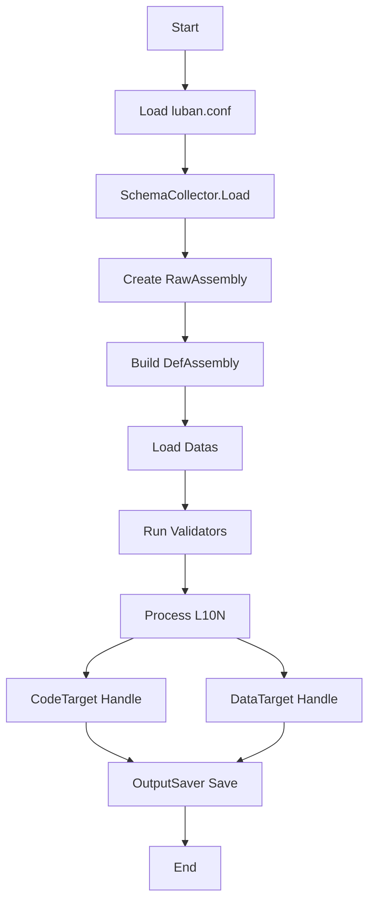

# Luban 全量分析文档

> 目标: 基于官方文档与本地源码/示例项目, 输出覆盖功能、实现细节与使用方式的全量分析材料, 作为二次开发与测试基线。  
> 新手使用入口: `docs/esyluban_beginner_guide.md`  
> 覆盖矩阵入口: `docs/coverage_matrix.md`

## 0. 文档目的与范围

- 覆盖 Luban 的完整使用方式、核心机制与实现路径, 并给出 Unity + JSON/BIN 的可复现讲解示例。
- 信息来源包括:
  - 官方文档: https://www.datable.cn/docs/intro (以及其子页面)
  - 本地源码: `luban/src/`
  - 本地示例: `luban_examples/`
- 本文不对“真实配置数据表内容”逐条解释, 但会完整解释“配置定义文件”和“工程脚本/配置文件”的语义与机制, 详见配套附录文档。

## 1. 标准项目开发环境与目录结构

### 1.1 环境与工具链

- 必需: `.NET SDK 8.0` 或更高版本 (官方快速上手要求)。
- 运行方式: `dotnet Luban.dll` (跨平台, Windows/Linux/macOS)。
- 示例与工具:
  - `luban_examples/Tools/Luban/` 里提供编译后的工具, 但不一定是最新。
  - 如需最新, 可从 `luban/src/Luban/Luban.csproj` 编译。

### 1.2 典型目录布局 (EsyLuban 新结构)

```
<ProjectRoot>
├─ Tools/
│  └─ Luban/
│     ├─ Luban.dll              # Luban 主程序
│     ├─ luban.conf             # 全局配置 (集中)
│     ├─ gen.bat                # 生成入口
│     ├─ check.bat              # 校验入口
│     ├─ install_luban_context_menu.bat
│     └─ uninstall_luban_context_menu.bat
├── scripts/
│     ├─ run_full_tests_example.bat
│     ├─ run_luban_context_menu_data.bat
│     └─ run_luban_context_menu_code.bat
├─ DataTables/
│  ├─ Defines/              # XML Schema 定义
│  ├─ matrix/                   # 覆盖矩阵正向用例
│  ├─ negatives/                # 负向用例 (单独跑)
│  ├─ Assets/                   # path 校验资源根
│  └─ l10n/                     # 本地化资源
├─ Projects/                    # 各目标平台项目
└─ TestOutputs/                 # 测试导出结果 (模板默认)
```

说明: 旧结构中的 `DataTables/Datas` 与 `DataTables/Defines` 被新结构替换, 建议将数据表直接放入 `DataTables/` 并将 XML 迁入 `DataTables/Defines/`。

### 1.3 核心产物

- 代码产物: `outputCodeDir` 指向的目录 (例如 Unity 项目中的 `Assets/Gen`)。
- 数据产物: `outputDataDir` 指向的目录 (例如 `GenerateDatas/json` 或 `GenerateDatas/bytes`)。
- 加载入口: 生成的 `cfg.Tables` 类作为所有表的统一入口。

## 2. 使用方式全量说明 (文档 + 源码 + 示例)

### 2.1 设计哲学与 DPP 管线

**官方要点**  
Luban 的核心是“完备类型系统 + DPP 管线”。它将“定义、加载、校验、代码生成、数据生成”拆成独立环节, 使扩展更清晰。

**源码映射**  
`Luban.Core/Pipeline/DefaultPipeline.cs` 展示了完整流程:

1. `LoadSchema` 载入 schema 定义  
2. `PrepareGenerationContext` 构建 DefAssembly  
3. `ProcessTargets` 执行 code target + data target  
4. `LoadDatas` + `Validate` + `L10N` 处理数据与校验

**关键结论**  
扩展点集中在 SchemaCollector、DataLoader、Validator、CodeTarget、DataTarget、PostProcess、OutputSaver, 由 `CustomBehaviour` 统一注册。

### 2.2 schema 逻辑结构

Luban 的逻辑 schema 由以下核心元素构成:

- **Enum**  
  - 字段: namespace, name, isFlags, isUniqueItemId, comment, tags, groups, items, typeMappers  
  - 对应实现: `RawEnum`, `EnumItem`
- **Bean**  
  - 字段: namespace, name, parent, isValueType, alias, sep, comment, tags, groups, fields, typeMappers  
  - 对应实现: `RawBean`, `RawField`
- **Table**  
  - 字段: namespace, name, valueType, index, mode, inputFiles, outputFileName, groups, tags  
  - 对应实现: `RawTable`

这些逻辑结构由 DefaultSchemaCollector 生成, 再转化为 `DefAssembly`, 用于后续类型解析与生成。

### 2.3 schema 定义格式 (DefaultSchemaCollector)

DefaultSchemaCollector 支持三种定义形式:

1. **Excel 定义** (`__tables__.xlsx / __beans__.xlsx / __enums__.xlsx`)  
   - 解析器: `Luban.Schema.Builtin/ExcelSchemaLoader.cs`  
   - 每种文件内包含固定列结构, 具体字段详见附录文档。

2. **同文件内联枚举/Bean 子表** (`__enums__` / `__beans__`)  
   - 扫描 `dataDir` 下 Excel 文件, 若存在同名子表则自动加载  
   - sheet 名大小写不敏感，子表结构需与 `__enums__.xlsx` / `__beans__.xlsx` 一致  
   - 作用域为 file-wide，同一文件内可复用  
   - 解析器: `Luban.Schema.Builtin/ExcelSchemaLoader.cs`

3. **XML 定义** (`Defines/*.xml`)  
   - 解析器: `Luban.Schema.Builtin/XmlSchemaLoader.cs`  
   - 支持 `<module> / <enum> / <bean> / <table> / <refgroup> / <constalias>`。

此外支持 **自动导入 table**:  
`Luban.Schema.Builtin/DefaultTableImporter.cs` 原本按文件名规则自动生成 table。EsyLuban 已将其改为 **读取 Sheet 的 B1 元数据** 作为唯一导表入口, 原 `#AutoImport` 方案废弃。

### 2.4 类型系统与类型语法

源码入口: `Luban.Core/Defs/DefAssembly.CreateType`.

**基础类型**  
`bool, byte, short, int, long, float, double, string, text, datetime`

**容器类型**  
`array, list, set, map`  
语法示例: `list,int` / `map,int,string`

**可空类型**  
通过 `?` 标记: `int?` / `string?` / `Bean?`  
容器元素不允许可空。

**非默认值标记**  
`!` 将触发 `not-default` 校验器。

**text 类型**  
`text` 实际为 `string#text=1`, 会触发本地化校验。

### 2.5 Excel 格式 (基础与高级)

**基础规则**  
见官方文档 *Excel Format (Primary)*。

标题行与行标签规则:  
- `##var` 字段名  
- `##type` 字段类型  
- `##group` 分组 (可选)  
- `##comment`/`##desc` 注释  
源码: `Luban.DataLoader.Builtin.Excel/SheetLoadUtil.cs`

**高级特性**
- 多级标题头 (字段子结构)  
  - `SheetLoadUtil.ParseSubTitles` 支持任意层级
- 多行结构列表  
  - 字段名前缀 `*` 标记多行
- column limit / map 特殊列限制  
  - 由 TitleRow/SheetDataCreator 控制解析
- 常量别名 `constalias`  
  - 仅 Excel 族与 lite 格式生效

### 2.5.1 自包含表定义 (##export + B1 元数据)

为消除 `__tables__.xlsx` 的维护负担, EsyLuban 采用**自包含表定义**:

- A1: `##export` 或 `##export=false` 控制是否导出该 Sheet。
- B1: 表定义元数据, 以 `key="value" & key2="value2"` 形式组织。
- 原先的 `##var/##type/##group/##comment` 行整体下移到第 2 行开始。

**支持字段 (与 __tables__.xlsx 含义一致)**  
`full_name`, `value_type`, `index`, `mode`, `group`, `comment`, `read_schema_from_file`, `input`, `output`, `tags`

**解析规则要点**
- **`full_name` 是唯一必填项**，其余字段均有缺省（2026-07 起）。
- `value_type` 未写时由表名推导：`TbItem` -> `Item`。
- `output` 未写时由全名生成：`item.TbItem` -> `item_tbitem`。
- `index` 未写时留空，交由上游取值类型的第一个字段。
- `mode` 未写时为 `map`。
- `read_schema_from_file` 未写时默认 **`false`**（结构来自 XML 或 `__beans__`）。
- `input` 未写时指向本 sheet 自己，等价于 `sheet@file`；
  注意只写文件路径（不带 `@sheet`）表示读该文件**全部 sheet**，与缺省不等价。
- B1 支持双引号值, 引号内允许 `&` 字符; `\"` 可转义引号。
- `##export=false` 时直接跳过该 Sheet。

> 详细的缺省语义与适用场景见 `docs/esyluban_beginner_guide.md` A3.1 / A3.4。

### 2.6 Excel 紧凑格式 (Compact Format)

支持格式: `stream` / `lite` / `json` / `lua`  
语法来源: 官方 `excelcompactformat` 文档

关键点:
- 默认是 stream 格式, `field#format=lite` 可切换
- sep 可定义字段拆分, 既可写在 field 名上, 也可写在 type/bean tag 上
- lite 格式更适合复杂嵌套结构, 无字段名, 更紧凑

### 2.7 非 Excel 数据源

支持数据源: json / lua / xml / yaml / lite / unity asset  
源码入口: `Luban.DataLoader.Builtin`

**要点**
- `inputFiles` 指向目录时递归读取所有文件 (排除 . ~ _ 前缀)
- `*field@file` 表示复合文件中的列表字段
- 多态类型:
  - JSON 使用 `$type`
  - XML 使用 `type` 属性
  - Lua 使用 `_type_`
- 记录 tag 统一字段名 `__tag__`

### 2.8 数据标签与过滤

数据标签用于过滤或忽略记录:
- `##` 表示永不导出  
- `unchecked` 表示跳过校验器

控制参数:
- `--includeTag`
- `--excludeTag`

源码: `Record.IsNotFiltered` + `LoadDataUtil.ParseTags`

### 2.9 字段变体 (Variants)

适用于本地化等多版本配置:
- 定义 variants: `value` 字段 + `value@en` / `value@zh`
- 生成时通过 `--variant TestBean.value=en` 指定
- 未指定时, 走默认值并给出警告

源码: `DefField.Compile` + `DefAssembly.TryGetVariantNameOrDefault`

### 2.10 校验器

内置校验器 (由 `ValidatorAttribute` 注册):

- `ref` 引用合法性  
  - `int#ref=tableName` / `int#ref=field@tableName`  
  - 支持 `?` 允许默认值  
  - 详见 `RefValidator`
- `range` 数值范围  
  - `[1,10]` / `(1,10]`  
  - 详见 `RangeValidator`
- `set` 值集合  
  - `int#set=1,2,3`  
  - 详见 `SetValidator`
- `size` 容器大小  
  - `list#size=[1,3]`  
  - 详见 `SizeValidator`
- `index` 结构列表唯一索引  
  - `list#index=id`  
  - 详见 `IndexValidator`
- `regex` 正则  
  - `string#regex=...`  
  - 详见 `RegexValidator`
- `path` 资源路径  
  - `string#path=unity` / `string#path=normal;...`  
  - 依赖 `-x pathValidator.rootDir=...`
- `not-default` 非默认值  
  - 通过 `!` 触发
- `text` 本地化 key  
  - `text` 类型触发

### 2.11 本地化 (L10N)

关键参数:
- `-x l10n.provider=default`
- `-x l10n.textFile.path=*@path` (注意 `*@` 对应复合文件列表)
- `-x l10n.textFile.keyFieldName=key`
- `-x l10n.textFile.languageFieldName=zh`
- `-x l10n.convertTextKeyToValue=1`

对应实现: `Luban.L10N.DefaultTextProvider` + `TextValidator`

### 2.12 代码与数据生成

**命令行参数**  
详见 `Luban/Program.cs` 与官方 “命令行工具” 文档:

```
dotnet Luban.dll -t <target> -c <codeTarget> -d <dataTarget> --conf <luban.conf> -x key=value ...
```

**codeTarget / dataTarget**  
官方文档列出完整列表, 本地源码中通过属性注册:
- CodeTarget: `Luban.CSharp/`, `Luban.Java/`, `Luban.Golang/` 等
- DataTarget: `Luban.DataTarget.Builtin/`, `Luban.Bson`, `Luban.MsgPack`, `Luban.Protobuf`

**OutputSaver / PostProcess**  
默认 OutputSaver 为 `local` (输出到文件), 可设置为 `null` 跳过输出。  
PostProcess 默认无内置实现, 可自定义。

### 2.13 Unity 示例 (JSON / BIN)

**JSON 生成脚本**  
`luban_examples/Projects/Csharp_Unity_json/gen.bat`

核心参数:
- `-t client`
- `-c cs-simple-json`
- `-d json`
- `-x outputCodeDir=Assets/Gen`
- `-x outputDataDir=..\GenerateDatas\json`

**Unity 加载示例**  
`Assets/Main.cs`:

```
var tables = new cfg.Tables(LoadByteBuf);
Debug.LogFormat("item[1].name:{0}", tables.TbItem[1].Name);
```

**BIN 生成脚本**  
`luban_examples/Projects/Csharp_Unity_bin/gen.bat`

核心参数:
- `-t client`
- `-c cs-bin`
- `-d bin`
- `-x outputCodeDir=Assets/Gen`
- `-x outputDataDir=..\GenerateDatas\bytes`

**BIN 加载示例**  
`Assets/Main.cs`:

```
var tables = new cfg.Tables(LoadByteBuf);
var item = tables.TbItem.DataList[1];
```

### 2.14 运行时加载注意事项

- `cfg.Tables` 通常只需加载一次并缓存。
- Unity StreamingAssets 在移动端需自行处理异步加载。
- 生成目录会被清理, `outputCodeDir` 和 `outputDataDir` 必须是安全的独立目录。

### 2.15 最佳实践 (结合官方建议)

- 表名推荐 `TbXxxYyy`, 字段名推荐 `xx_yy_zz`。
- 高复杂数据(技能/AI)建议用多态结构 + 非 Excel 数据源。
- 开发期用 JSON, 发布期用 BIN。
- 使用 githooks 或 watch 机制确保配置提交时自动校验。

### 2.16 官方文档补充要点 (Features / Type Mapping / Code Style / Validator / Auto-Import)

- 特性补充 (Features):  
  - 增强 Excel: bool 允许 `true/false/1/0`, 支持枚举别名/值, 支持 `null` 与 `datetime`, 支持结构体跨多格/单格/拆分、单元格分隔、嵌套结构、多态、结构列表多行、**多级表头**。  
  - 数据源组合: 允许目录递归 + 混合格式, 同一表支持多源组合 (多对一/一对多/多对多)。  
  - 导出格式: bin/json/lua/xml/yaml/protobuf/msgpack/flatbuffers 等, 与源格式解耦。  
  - 支持表/字段分组、data tag、丰富校验器、多表模式 (one/map/list)、完善 L10N。  
  - 多语言/多引擎/跨平台支持与生成速度强调。
- 类型系统补充:  
  - `text` 是 `string#text=1` 的语法糖, 用于 L10N key 校验。  
  - `datetime` 在 C# 中为 long, 含义为 UTC 秒。  
  - 生成代码包含 `table` 与 `tables` 管理类 (类名由 `targets[].manager` 控制)。
- 类型映射 (Type Mapping):  
  - 仅 C# 代码目标支持, 通过 `<mapper target="..." codeTarget="...">` + `option name="type"` 指定外部类型。  
  - `enum` 采用强制类型转换, 值必须完全一致。  
  - `bean` 需额外 `constructor` 进行外部类型构造/转换。
- 代码风格 (Code Style):  
  - 内置命名风格 `none/camel/pascal/upper/snake`。  
  - 可配置位置: namespace/type/method/property/field/enumItem。  
  - 关键参数: `codeStyle`, `namingConvention.{codeTarget}.{location}`。
- 校验器补充:  
  - `notDefault` 用 `!` 标记 (如 `int!`, `int?!`)。  
  - `ref` 根据表模式区分写法, 支持 `?` 忽略空值与 nullable。  
  - `path` 支持 `normal/unity/ue/godot` 并依赖 `pathValidator.rootDir`。  
  - `set` 建议用 `;` 分隔避免与容器语法冲突。
- Auto-Imported Table (官方):  
  - 默认扫描 `#*.xlsx` 生成表 (DefaultTableImporter)。  
  - 本次二次开发将**弃用**该机制, 以自包含 `##export + B1 元数据` 为主。

### 2.17 右键菜单集成 (Windows)

- 安装: `Tools/Luban/install_luban_context_menu.bat` (HKLM, 需管理员)
- 卸载: `Tools/Luban/uninstall_luban_context_menu.bat`
- 入口: `scripts/run_luban_context_menu_data.bat` / `scripts/run_luban_context_menu_code.bat`（安装时复制到 `%ProgramData%\EsyLuban`，确保全局唯一）

行为:
- 从所选路径向上最多 5 层寻找 `Tools/Luban`。
- 选中文件: 仅导出该文件中 `##export` 的 Sheet。
- 选中文件夹: 递归扫描并导出 (排除 `__beans__`/`__enums__`/`__tables__`)。
- 通过 `-x tableImporter.scanPath` 限定导表范围。

## 3. 实现细节 (源码级映射)

### 3.1 生成流程图



### 3.2 关键代码路径索引

- 命令入口: `luban/src/Luban/Program.cs`
- 配置解析: `luban/src/Luban.Core/GlobalConfigLoader.cs`
- Pipeline: `luban/src/Luban.Core/Pipeline/DefaultPipeline.cs`
- SchemaCollector: `luban/src/Luban.Schema.Builtin/DefaultSchemaCollector.cs`
- Excel 定义解析: `luban/src/Luban.Schema.Builtin/ExcelSchemaLoader.cs`
- XML 定义解析: `luban/src/Luban.Schema.Builtin/XmlSchemaLoader.cs`
- 类型系统: `luban/src/Luban.Core/Defs/DefAssembly.cs`
- 数据加载: `luban/src/Luban.Core/DataLoader/DataLoaderManager.cs`
- 校验器: `luban/src/Luban.DataValidator.Builtin/*`
- L10N: `luban/src/Luban.L10N/*`

## 4. 测试验证清单 (用于二次开发)

> 目标: 覆盖定义、加载、校验、导出、运行时加载的全路径。

### 4.1 定义层

- Excel / XML 两种 schema 定义正确性
- __tables__/__beans__/__enums__ 的列字段完整性
- readSchemaFromFile 自动定义
- typeMapper 映射生效
- constalias 生效

### 4.2 数据加载层

- Excel (普通表 / 单例表 / list 表 / 多级标题 / 多行结构)
- JSON / XML / YAML / Lua / Lite / Unity Asset 数据解析
- 复合文件格式 `*field@file`
- 文件/目录递归读取

### 4.3 校验层

- ref / range / size / set / regex / path / text / not-default / index
- 记录 tags 过滤 (includeTag / excludeTag)

### 4.4 生成层

- 多 codeTarget 输出目录隔离
- 多 dataTarget 输出目录隔离
- fileExt / fileEncoding / lineEnding 生效
- bin-offset 兼容

### 4.5 运行时层

- Unity JSON / BIN 加载验证
- 多态类型实例化
- L10N key 校验与静态替换

### 4.6 全覆盖测试模板 (EsyLuban)

- 入口脚本: `esyluban/scripts/test/run_full_tests_example.bat`
- 数据目录: `esyluban/examples/dev/DataTables/`
- 输出目录: `esyluban/examples/dev/TestOutputs/`
- 无 L10N 输出: `esyluban/examples/dev/TestOutputs/json_nol10n`
- 核心基线: `esyluban/baselines/core`（源自上游 luban_examples 未迁移版本的输出，已固化）
- 覆盖基线: `esyluban/baselines/coverage`
- 对比报告:
  - 核心一致性: `esyluban/examples/dev/TestOutputs/compare_report.json`
  - 覆盖一致性: `esyluban/examples/dev/TestOutputs/compare_report_coverage.json`
- 负例日志: `esyluban/examples/dev/TestOutputs/negative_tests.log`
- 覆盖基线刷新: `esyluban/scripts/test/refresh_coverage_baseline.bat`
- 资源根: `DataTables/Assets/` (用于 path 校验)
- 本地化: `DataTables/l10n/texts.xlsx` (配合 `text` 类型字段)

## 5. 来源索引

### 5.1 官方文档

- 介绍: https://www.datable.cn/docs/intro  
- User Guide: https://www.datable.cn/en/docs/basic  
- 新手教程索引: https://www.datable.cn/en/docs/beginner  
- 快速上手: https://www.datable.cn/docs/beginner/quickstart  
- 使用自定义类型: https://www.datable.cn/en/docs/beginner/usecustomtype  
- 设计哲学: https://www.datable.cn/docs/manual/architecture  
- 特性清单: https://www.datable.cn/en/docs/manual/traits  
- Schema 逻辑结构: https://www.datable.cn/docs/manual/schema  
- 配置定义: https://www.datable.cn/docs/manual/defaultschemacollector  
- luban.conf: https://www.datable.cn/en/docs/manual/luban.conf  
- 命令行工具: https://www.datable.cn/docs/manual/commandtools  
- 类型系统: https://www.datable.cn/en/docs/manual/types  
- 类型映射: https://www.datable.cn/en/docs/manual/typemapper  
- 代码风格: https://www.datable.cn/en/docs/manual/codestyle  
- Excel 主格式: https://www.datable.cn/en/docs/manual/excel  
- Excel 高级格式: https://www.datable.cn/en/docs/manual/exceladvanced  
- Excel 紧凑格式: https://www.datable.cn/en/docs/manual/excelcompactformat  
- 非 Excel 数据源: https://www.datable.cn/en/docs/manual/otherdatasource  
- data tag: https://www.datable.cn/en/docs/manual/tag  
- 字段变体: https://www.datable.cn/en/docs/manual/variants  
- 数据校验器: https://www.datable.cn/en/docs/manual/validator  
- Auto-Imported Table: https://www.datable.cn/en/docs/manual/importtable  
- 本地化: https://www.datable.cn/docs/manual/l10n  
- 代码与数据生成: https://www.datable.cn/en/docs/manual/generatecodedata  
- 运行时加载: https://www.datable.cn/en/docs/beginner/loadinruntime  
- 最佳实践: https://www.datable.cn/en/docs/manual/bestpractices  

### 5.2 本地源码与示例

- 源码入口: `luban/src/`  
- 示例入口: `luban_examples/`  
- Unity 示例: `luban_examples/Projects/Csharp_Unity_json`, `luban_examples/Projects/Csharp_Unity_bin`  

## 6. 更新记录

- 2026-01-22: 初版输出
- 2026-01-22: 补全文档覆盖, 完成自包含表定义与新目录/右键/测试模板
